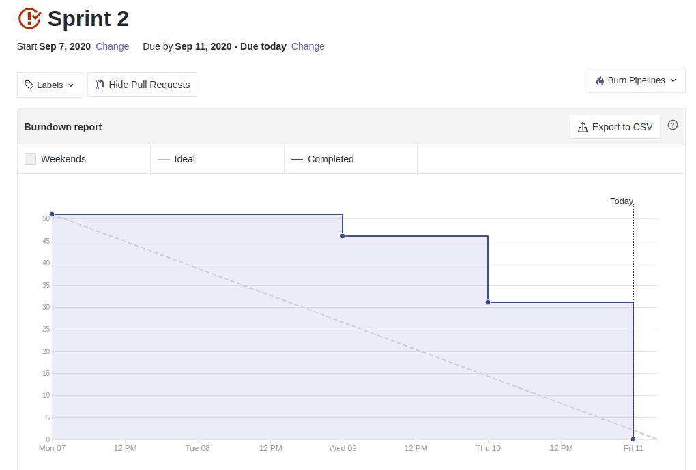
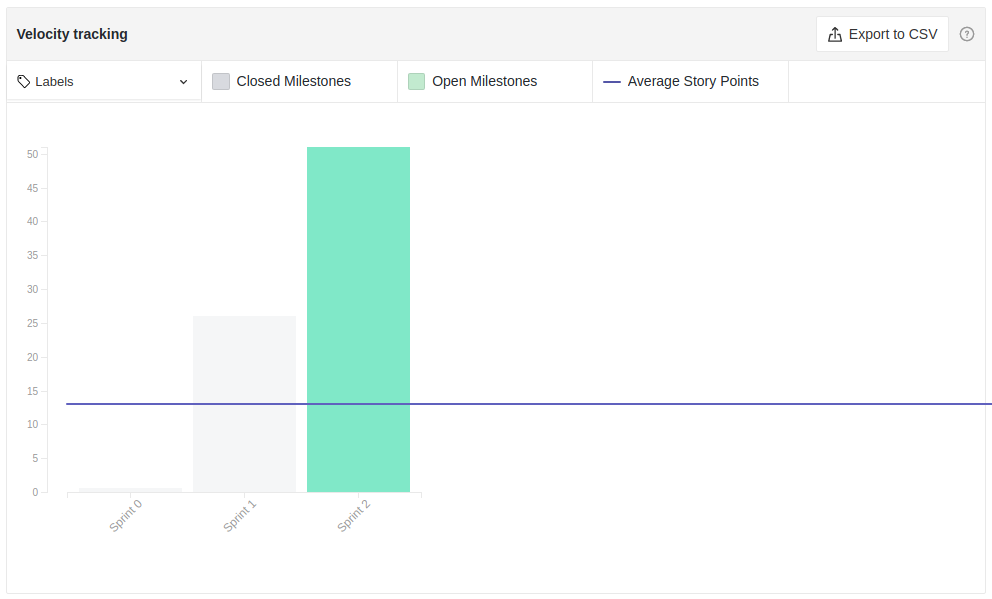

# Resultado Sprint 2
**Período: 06/09/2020 a 11/09/2020** 
**Data da Reunião: 11/09/2020**

## Issues Entregues

|Número | Issue | Pontuação | Participantes|
| - | - | - | - |
| [**#6**](https://github.com/UnBArqDsw/2020.1_G12_Stock/issues/6)  | Questionário | 2 | Todos |
| [**#16**](https://github.com/UnBArqDsw/2020.1_G12_Stock/issues/16)| Estimativas | 8 | Todos |
| [**#29**](https://github.com/UnBArqDsw/2020.1_G12_Stock/issues/29)|Design Sprint| Sem | Todos
| [**#31**](https://github.com/UnBArqDsw/2020.1_G12_Stock/issues/31)| Causa-Efeito | Sem | Todos |
| [**#35**](https://github.com/UnBArqDsw/2020.1_G12_Stock/issues/35)| Léxicos | 5 | Gabriel Alves |
| [**#36**](https://github.com/UnBArqDsw/2020.1_G12_Stock/issues/36)| Metodologia - Definição e Documentação | 5 | Micaella Gouveia, Sofia Patrocínio |
| [**#37**](https://github.com/UnBArqDsw/2020.1_G12_Stock/issues/37)| Metodologia - BPMN | 13 | Gabriel Alves, Gabriel Davi, Pedro Igor |
| [**#38**](https://github.com/UnBArqDsw/2020.1_G12_Stock/issues/38)| Entrevistas | 5 | Gabriel Alves, Pedro Igor, Sofia Patrocínio |
| [**#39**](https://github.com/UnBArqDsw/2020.1_G12_Stock/issues/39)| Introspecção| 5 | Gabriel Davi, Micaella Gouveia |
| [**#40**](https://github.com/UnBArqDsw/2020.1_G12_Stock/issues/40)| Elicitação dos artefatos já produzidos| 5 | Gabriel Davi, Pedro Igor |
| [**#41**](https://github.com/UnBArqDsw/2020.1_G12_Stock/issues/41)| Gravações | 8 | Sofia Patrocínio |
| [**#42**](https://github.com/UnBArqDsw/2020.1_G12_Stock/issues/42)| Documentação Reuniões e Sprints| 5 | Micaella Gouveia |
| [**#49**](https://github.com/UnBArqDsw/2020.1_G12_Stock/issues/49)| Storyboards - Evolução | Sem | Micaella Gouveia e Sofia Patrocínio |

## Pontuação: 51 + 10 *(dívida técnica)* = 61
## Dívida Técnica: 0

## Quadro de Conhecimento
*Métrica ainda não usada nesta Sprint.*

## Burndown

## Velocity

## Observações
* Essa Sprint foi menor pois foi a Sprint antes da Primeira Entrega, que aconteceu no dia 11/09/2020 (sexta-feira).
* Essa Sprint foi voltada para a produção de documentos necessários para esta entrega, e para evolução de alguns documentos já feitos.
* Algumas issues possuíam uma data de entrega para não prejudicar o desenvolvimento de outras issues, sendo estas entregues em tempo ábil para o desenvolvimento das issues dependentes.
