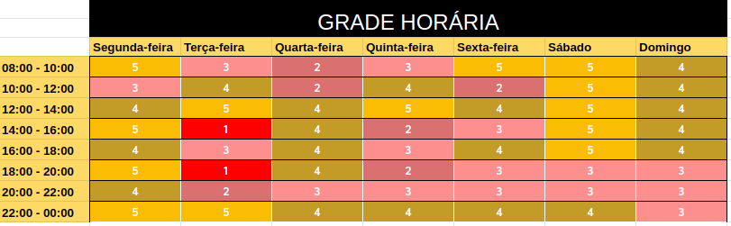

# Resultado Sprint 3 

**Período: 13/09/2020 a 19/09/2020** 
**Data da Reunião: 19/09/2020**

## [Issues](Modeling/objeto?id=Issue) Entregues

| Número | [Issue](Modeling/objeto?id=Issue) | Pontuação | Participantes |
|--------|-----------------------------------|-----------|---------------|
| [**#61**](https://github.com/UnBArqDsw/2020.1_G12_Stock/issues/61) | [Estimativas](Project/Evaluation.md) - Evolução | 2 | Gabriel Alves |
| [**#70**](https://github.com/UnBArqDsw/2020.1_G12_Stock/issues/70) | [Questionário](Elicitation/Questionario.md) - Evolução | 3 | Micaella Gouveia, Gabriel Davi e Sofia |
| [**#71**](https://github.com/UnBArqDsw/2020.1_G12_Stock/issues/71) | [Entrevistas](Elicitation/Entrevista.md) - Evolução | 5 | Gabriel Alves e Pedro Igor |
| [**#72**](https://github.com/UnBArqDsw/2020.1_G12_Stock/issues/72) | [BPMN](Project/ModelagemBPMN.md) - Evolução | 3 | Pedro Igor |
| [**#73**](https://github.com/UnBArqDsw/2020.1_G12_Stock/issues/73) | [Protótipo de baixa fidelidade](Product/PrototipoBaixa.md) | 3 | Todos |
| [**#75**](https://github.com/UnBArqDsw/2020.1_G12_Stock/issues/75) | Backlog | 8 | Todos |
| [**#76**](https://github.com/UnBArqDsw/2020.1_G12_Stock/issues/76) | Priorização | 5 | Todos |

## Pontuação: 29 

## Dívida Técnica
| Número | [Issue](Modeling/objeto?id=Issue) | Pontuação | Participantes |
|--------|-----------------------------------|-----------|---------------|
| [**#74**](https://github.com/UnBArqDsw/2020.1_G12_Stock/issues/74) | [Protótipo de média fidelidade](Product/PrototipoMedia.md) | 13 | Micaella, Sofia e Gabriel Davi |

## Quadro de Conhecimento
*Métrica ainda não usada nesta Sprint.*

## Burndown

## Velocity

## Observações
* A [issue](Modeling/objeto?id=Issue) [**#74**](https://github.com/UnBArqDsw/2020.1_G12_Stock/issues/74) ficou como dívida técnica pois não deu tempo de realizar os testes com os participantes, sendo esta [issue](Modeling/objeto?id=Issue) definida com entrega até segunda-feira.
* Notamos que definir datas de entrega das [issues](Modeling/objeto?id=Issue) melhorou significativamente o burndown da Sprint, sendo este um ponto forte desta Sprint.
* Para a definição das datas e horas das reuniões de [Protótipo de Baixa Fidelidade](../../Product/PrototipoBaixa.md), produção do Backlog e Priorização, foi feito um heatmap com todos os membros. A reunião

*Heatmap da Sprint 3 para decisão de horários das reuniões*

