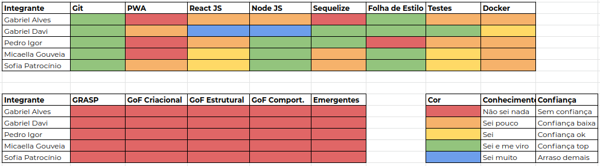

# Resultado Sprint 4
**Período: 20/09/2020 a 28/09/2020** 
**Data da Reunião: 28/09/2020**

## [Issues](Modeling/objeto?id=Issue) Entregues

| Número | [Issue](Modeling/objeto?id=Issue) | Pontuação | Participantes |
|--------|-----------------------------------|-----------|---------------|
| [**#74**](https://github.com/UnBArqDsw/2020.1_G12_Stock/issues/74) | [Protótipo de Média Fidelidade](Product/PrototipoMedia.md) | 13 | Micaella, Sofia e Gabriel Davi |
| [**#86**](https://github.com/UnBArqDsw/2020.1_G12_Stock/issues/86) | [NFR](Modeling/NFR.md) | 5 | Gabriel Alves e Gabriel Davi |
| [**#87**](https://github.com/UnBArqDsw/2020.1_G12_Stock/issues/87) | [Especificação Suplementar](Modeling/EspecificacaoSuplementar.md) | 3 | Pedro Igor |
| [**#88**](https://github.com/UnBArqDsw/2020.1_G12_Stock/issues/88) | [Diagrama de Classes](Modeling/Diagrams/Classes.md) e [Diagrama de Componentes](Modeling/Diagrams/Componentes.md) | 13 | Todos |
| [**#89**](https://github.com/UnBArqDsw/2020.1_G12_Stock/issues/89) | [Diagrama de Sequência](Modeling/Diagrams/Sequencia) e [Diagrama de Comunicação](Modeling/Diagrams/Comunicacao.md) | 8 | Todos |
| [**#90**](https://github.com/UnBArqDsw/2020.1_G12_Stock/issues/90) | [Diagrama Atividades](Modeling/Diagrams/Atividades) e [Diagrama de Estado](Modeling/Diagrams/Estado) | 5 | Todos |
| [**#91**](https://github.com/UnBArqDsw/2020.1_G12_Stock/issues/74) | [Entidade Relacionamento de Banco de Dados](Modeling/Diagrams/EntidadeRelacionamento.md) e [Diagrama de Pacotes](Modeling/Diagrams/Pacotes.md) | 13 | Todos |
| [**#92**](https://github.com/UnBArqDsw/2020.1_G12_Stock/issues/92) | [Treinamento React](Project/Omnistock) :) | 8 | Gabriel Davi |
| [**#94**](https://github.com/UnBArqDsw/2020.1_G12_Stock/issues/94) | [Protótipo de Alta Fidelidade](Product/PrototipoAlta.md) | 8 | Micaella Gouveia e Sofia Patrocínio |

## Pontuação:  63 + 13 (dívida técnica)

## Quadro de Conhecimento

## Burndown

## Velocity

## Observações
* A [issue](Modeling/objeto?id=Issue) [**#93**](https://github.com/UnBArqDsw/2020.1_G12_Stock/issues/93) ficou como Backlog, e com o tempo curto, nenhum membro conseguiu assumir a responsabilidade, porém ela permanecerá para a próxima Sprint.

