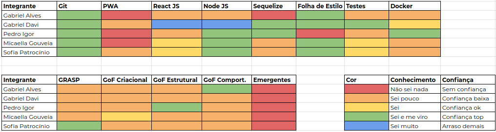
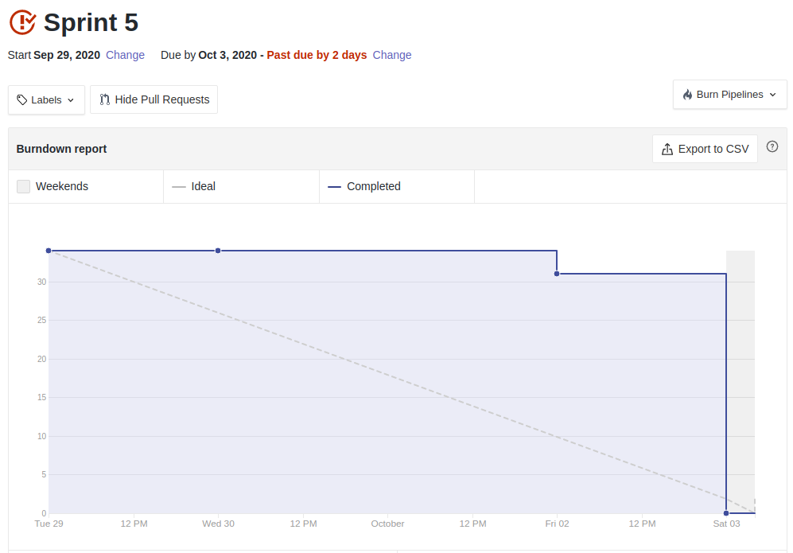
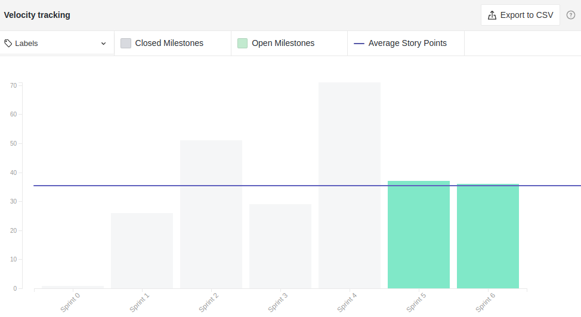

# Resultado Sprint 5

**Período: 29/09/2020 a 03/10/2020** 
**Data da Reunião: 03/10/2020**

## Issues Entregues

| Número | [Issue](Modeling/objeto?id=Issue) | Pontuação | Participantes |
|--------|-----------------------------------|-----------|---------------|
| [**#93**](https://github.com/UnBArqDsw/2020.1_G12_Stock/issues/93) | [Casos de Uso e Diagrama de Casos de Uso](Modeling/CasosUso/CasosUso.md) | 5 | Gabriel Davi, Micaella Gouveia e Pedro Igor | 
| [**#113**](https://github.com/UnBArqDsw/2020.1_G12_Stock/issues/113) | [Estudo - GRASP](Project/Estudos/GRASP.md) | 8 | Sofia | - |
| [**#114**](https://github.com/UnBArqDsw/2020.1_G12_Stock/issues/114) | [Estudo - GoF Criacional](Project/Estudos/criacional.md) | 5 | Micaella Gouveia |
| [**#115**](https://github.com/UnBArqDsw/2020.1_G12_Stock/issues/115) | [Estudo - GoF Estrutural 1](Project/Estudos/estrutural1.md) | 3 | Pedro Igor |
| [**#117**](https://github.com/UnBArqDsw/2020.1_G12_Stock/issues/117) | [Estudo - GoF Comportamental](Project/Estudos/comportamental.md) | 5 | Gabriel Alves | 
| [**#118**](https://github.com/UnBArqDsw/2020.1_G12_Stock/issues/118) | Dockerização do Backend e Frontend | 8 | Pedro Igor e Gabriel Davi |

## Pontuação: 34

## Dívida Técnica
| Número | [Issue](Modeling/objeto?id=Issue) | Pontuação | Participantes |
|--------|-----------------------------------|-----------|---------------|
| [**#116**](https://github.com/UnBArqDsw/2020.1_G12_Stock/issues/116) | [Estudo - GoF Estrutural 2](Project/Estudos/estrutural2.md) | 3 | Gabriel Davi |
| [**#119**](https://github.com/UnBArqDsw/2020.1_G12_Stock/issues/119) | Documento de escolha das tecnologias | 3 | Gabriel Alves | 

## Quadro de Conhecimento

## Burndown

## Velocity

## Observações
* O time sentiu grande dificuldade durante a Sprint pois haviam entregas de outras matérias, cansaço da Entrega 2, além da Sprint ser menor que o usual.
* O time, durante a reunião, debateu sobre os Padrões de Projeto estudados, tentando alinhar todos os membros com cada padrão, melhorando o quadro de conhecimento sobre Padrões de Projeto.

