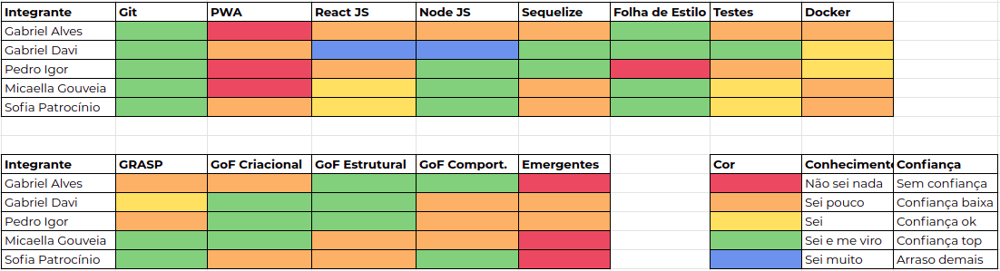

# Resultado Sprint 6

**Período: 04/10/2020 a 10/10/2020** 
**Data da Reunião: 10/10/2020**

## Issues Entregues

| Número | [Issue](Modeling/objeto?id=Issue) | Pontuação | Participantes |
|--------|-----------------------------------|-----------|---------------|
| [**#116**](https://github.com/UnBArqDsw/2020.1_G12_Stock/issues/116) | [Estudo - GoF Estrutural 2](Project/Estudos/estrutural2.md) | 3 | Gabriel Davi |
| [**#119**](https://github.com/UnBArqDsw/2020.1_G12_Stock/issues/119) | Documento de escolha das tecnologias | 3 | Gabriel Alves | 
| [**#130**](https://github.com/UnBArqDsw/2020.1_G12_Stock/issues/130) | Configuração do Sequelize | 8 | Gabriel Davi e Pedro Igor |
| [**#131**](https://github.com/UnBArqDsw/2020.1_G12_Stock/issues/131) | Adição do Dicionário de Dados | 8 | Gabriel Alves |
| [**#132**](https://github.com/UnBArqDsw/2020.1_G12_Stock/issues/132) | [Estudo - GRASP (Evolução)](Project/Estudos/GRASP.md) | 3 | Micaella Gouveia |
| [**#133**](https://github.com/UnBArqDsw/2020.1_G12_Stock/issues/133) | [Estudo - GoF Criacional  (Evolução)](Project/Estudos/criacional.md) | 3 | Pedro Igor |
| [**#134**](https://github.com/UnBArqDsw/2020.1_G12_Stock/issues/134) | [Estudo - GoF Estrutural 1 (Evolução)](Project/Estudos/estrutural1.md) | 3 | Gabriel Alves |
| [**#135**](https://github.com/UnBArqDsw/2020.1_G12_Stock/issues/135) | [Estudo - GoF Comportamental (Evolução)](Project/Estudos/comportamental.md) | 3 | Sofia Patrocínio |

## Pontuação: 39

## Dívida Técnica
| Número | [Issue](Modeling/objeto?id=Issue) | Pontuação | Participantes |
|--------|-----------------------------------|-----------|---------------|
| [**#129**](https://github.com/UnBArqDsw/2020.1_G12_Stock/issues/129) | Refatoração dos Diagramas | - | Micaella Gouveia e Sofia Patrocínio |

## Quadro de Conhecimento

## Burndown

## Velocity

## Observações
* O time sentiu grande dificuldade durante a Sprint devido a semana apertada e as mudanças climáticas.
* O time, durante a reunião, debateu sobre os Padrões de Projeto estudados, tentando alinhar todos os membros com cada padrão, melhorando o quadro de conhecimento sobre Padrões de Projeto.
