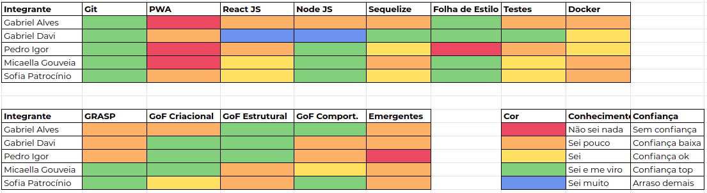
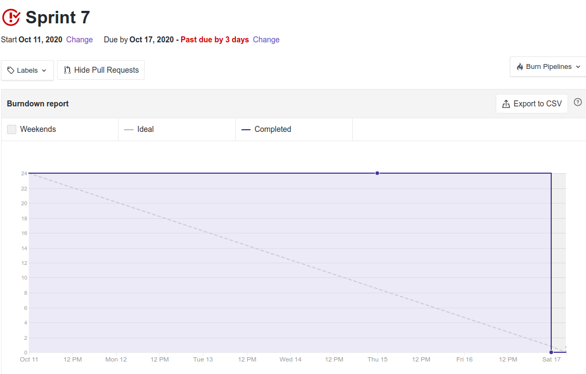
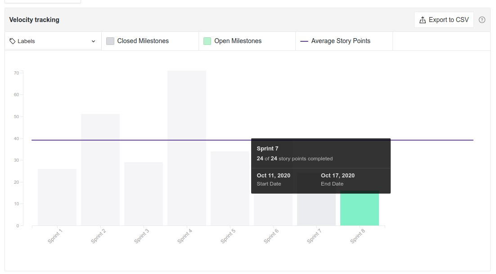

# Resultado Sprint 7

**Período: 11/10/2020 a 17/10/2020** 
**Data da Reunião: 17/10/2020**

## Issues Entregues

| Número | [Issue](Modeling/objeto?id=Issue) | Pontuação | Participantes |
|--------|-----------------------------------|-----------|---------------|
| [**#145**](https://github.com/UnBArqDsw/2020.1_G12_Stock/issues/145) | Refatorar Diagramas com base no Feedback da professora | 5 | Todos |
| [**#146**](https://github.com/UnBArqDsw/2020.1_G12_Stock/issues/146) | Refatorar Diagrama [Entidade Relacionamento](Modeling/Diagrams/EntidadeRelacionamento) | 3 | Gabriel Alves e Pedro Igor |
| [**#147**](https://github.com/UnBArqDsw/2020.1_G12_Stock/issues/147) | Implementar Hierarquia de Usuários com base no Factory Method | 8 | Micaella Gouveia e Sofia Patrocínio |
| [**148**](https://github.com/UnBArqDsw/2020.1_G12_Stock/issues/148) | Implementar Classificação de Produtos (perecível e não perecível) com base no Factory Method | 8 | Gabriel Alves e Pedro Igor |

## Pontuação: 40

## Dívida Técnica
| Número | [Issue](Modeling/objeto?id=Issue) | Pontuação | Participantes |
|--------|-----------------------------------|-----------|---------------|
| [**#129**](https://github.com/UnBArqDsw/2020.1_G12_Stock/issues/129) | Refatoração dos Diagramas com base nos Padrões de Projeto | 8 | Micaella Gouveia e Sofia Patrocínio |
| [**149**](https://github.com/UnBArqDsw/2020.1_G12_Stock/issues/149) | Implementar Classe Base para implementação do Decorator (com métodos cadastrar, listar e remover) | 8 | Gabriel Davi |

## Quadro de Conhecimento

## Burndown

## Velocity

## Observações
* O time usou a semana para testar aplicação de padrões de projeto e com base nisso, fizemos mudanças no projeto:
    - Mudança da linguagem pra JavaScript
    - Remoção do Factory Method do projeto