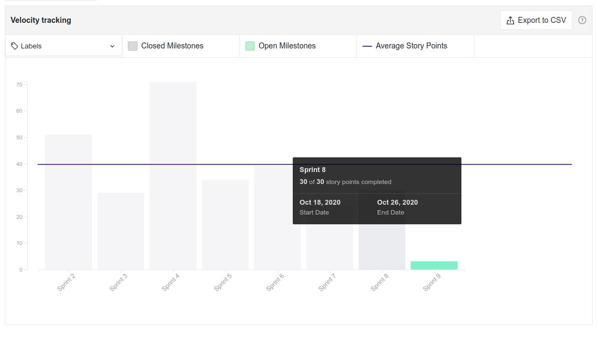

# Resultado Sprint 8

**Período: 18/10/2020 a 26/10/2020** 
**Data da Reunião: 26/10/2020**

## Issues Entregues

| Número | [Issue](Modeling/objeto?id=Issue) | Pontuação | Participantes |
|--------|-----------------------------------|-----------|---------------|
| [**#129**](https://github.com/UnBArqDsw/2020.1_G12_Stock/issues/129) | Refatoração dos Diagramas com base nos Padrões de Projeto | 8 | Micaella Gouveia e Sofia Patrocínio |
| [**149**](https://github.com/UnBArqDsw/2020.1_G12_Stock/issues/149) | Implementar Classe Base para implementação do Decorator (com métodos cadastrar, listar e remover) | 8 | Gabriel Davi |
| [**#159**](https://github.com/UnBArqDsw/2020.1_G12_Stock/issues/159)  | US02 - Login de Usuário  | 3 | Gabriel Davi |
| [**#160**](https://github.com/UnBArqDsw/2020.1_G12_Stock/issues/160)  | Verificação do Nível de Acesso  | 3 | Sofia Patrocínio |
| [**#161**](https://github.com/UnBArqDsw/2020.1_G12_Stock/issues/161)  | Documentação dos Padrões Utilizados  | 3 | Micaella Gouveia |
| [**#162**](https://github.com/UnBArqDsw/2020.1_G12_Stock/issues/161)  | Implementação de GRASP's para Produtos  | 8 | Pedro Igor e Gabriel Alves |

## Pontuação: 33

## Dívida Técnica
| Número | [Issue](Modeling/objeto?id=Issue) | Pontuação | Participantes |
|--------|-----------------------------------|-----------|---------------|
| [**#163**](https://github.com/UnBArqDsw/2020.1_G12_Stock/issues/161)  | Criação da rota de cadastro de empresa e Usuário Owner | 3 | Gabriel Alves |

## Quadro de Conhecimento

## Burndown

## Velocity

## Observações
* A issue de dívida técnica não foi entregue, nem justificada. Essa issue será mudada para uma história de usuário
* A issue de verificação de usuário foi transformada em US02 - Login de Usuário