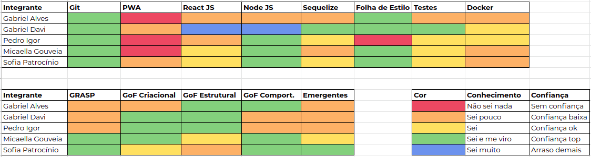
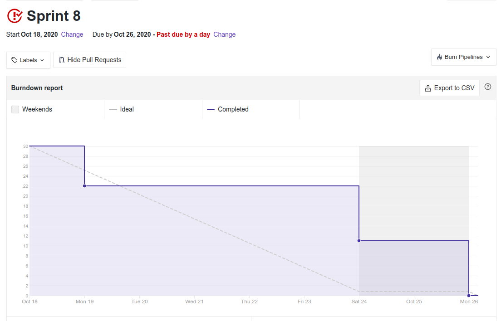
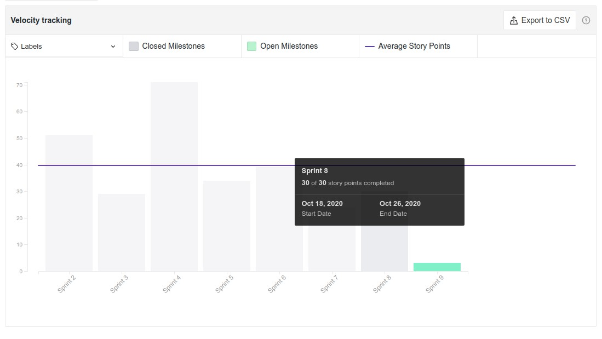

# Resultado Sprint 9

**Período: 27/10/2020 a 01/11/2020** 
**Data da Reunião: 27/10/2020**

## Issues Entregues
| Número                                                             | [Issue](Modeling/objeto?id=Issue)                                                                                                             | Pontuação | Participantes           |
| ------------------------------------------------------------------ | --------------------------------------------------------------------------------------------------------------------------------------------- | --------- | ----------------------- |
| [**#176**](https://github.com/UnBArqDsw/2020.1_G12_Stock/issues/176)  | US01 - Cadastro da empresa  | 8 | Micaella Gouveia e Pedro Igor  |
| [**#177**](https://github.com/UnBArqDsw/2020.1_G12_Stock/issues/177)  | Elaboração tela inicial  | 5 | Sofia Patrocínio |
| [**#178**](https://github.com/UnBArqDsw/2020.1_G12_Stock/issues/178)  | Criação sidebar e navbar  | 5 | Gabriel Davi |
|  [**#183**](https://github.com/UnBArqDsw/2020.1_G12_Stock/issues/183) | Evolução protótipo  | 3 | Gabriel Davi e Pedro Igor  |

## Pontuação: 33

## Dívida Técnica
| Número | [Issue](Modeling/objeto?id=Issue) | Pontuação | Participantes |
|--------|-----------------------------------|-----------|---------------|
| [**#163**](https://github.com/UnBArqDsw/2020.1_G12_Stock/issues/161)  | Criação da rota de cadastro de empresa e Usuário Owner | 3 | Gabriel Alves |

## Quadro de Conhecimento

## Burndown

## Velocity

## Observações
* O membro Gabriel Alves comunicou a saída da disciplina.
* A membra Sofia Patrocínio ficou doente durante a Sprint, ocasionando atraso nas entregas. 
- Como essa Sprint foi menor, devido a entrega na segunda, adicionamos mais um dia na Sprint, finalizando no domingo, dia 01/11.