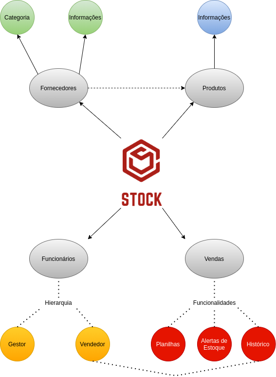
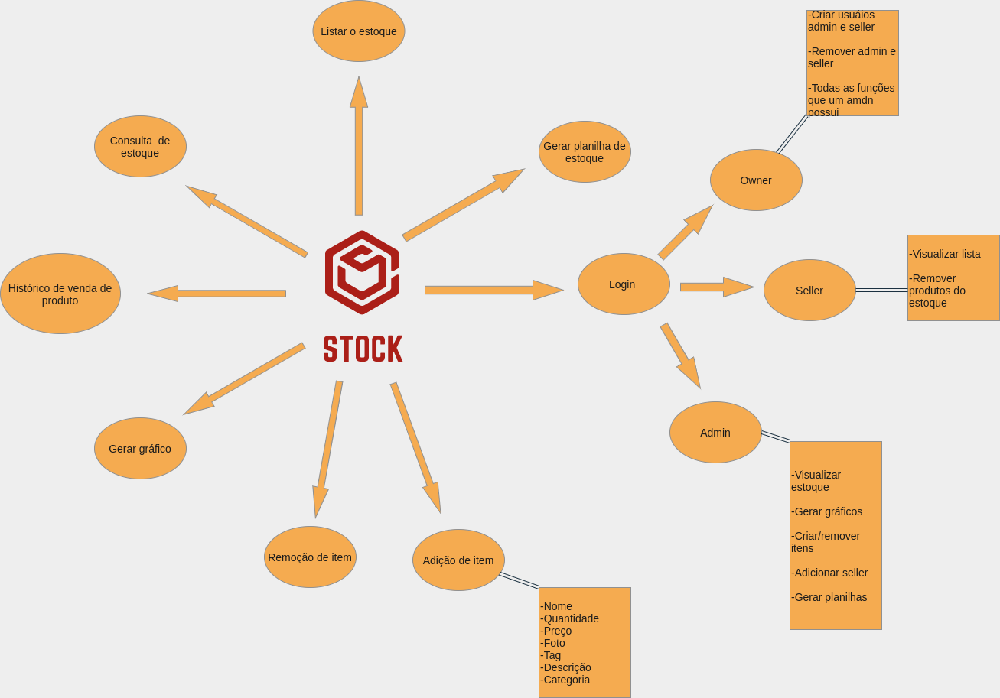
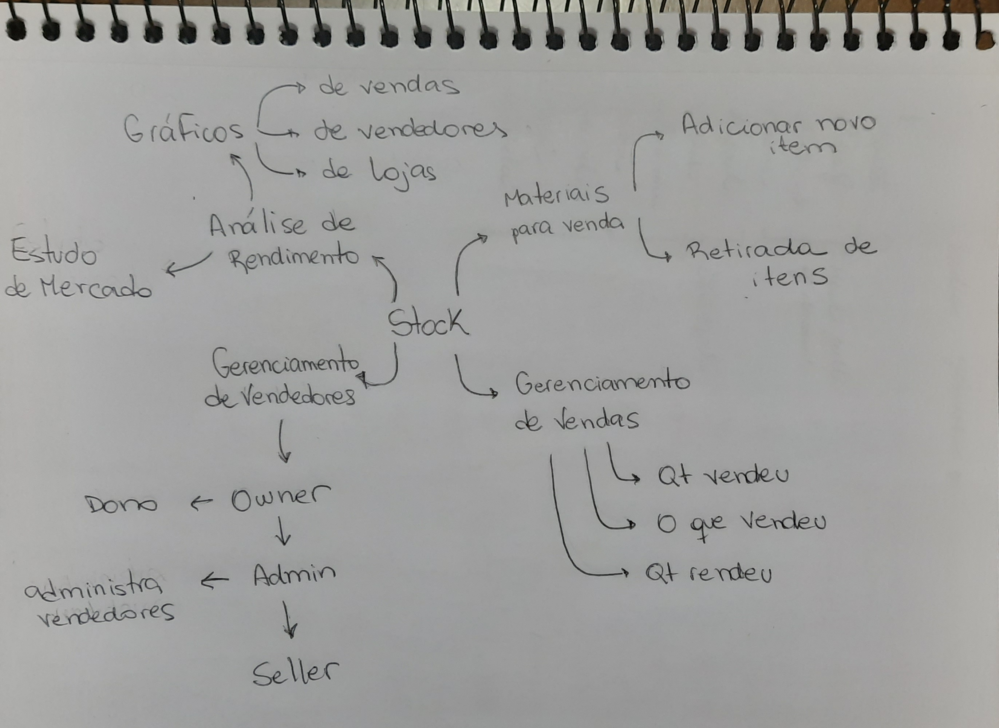
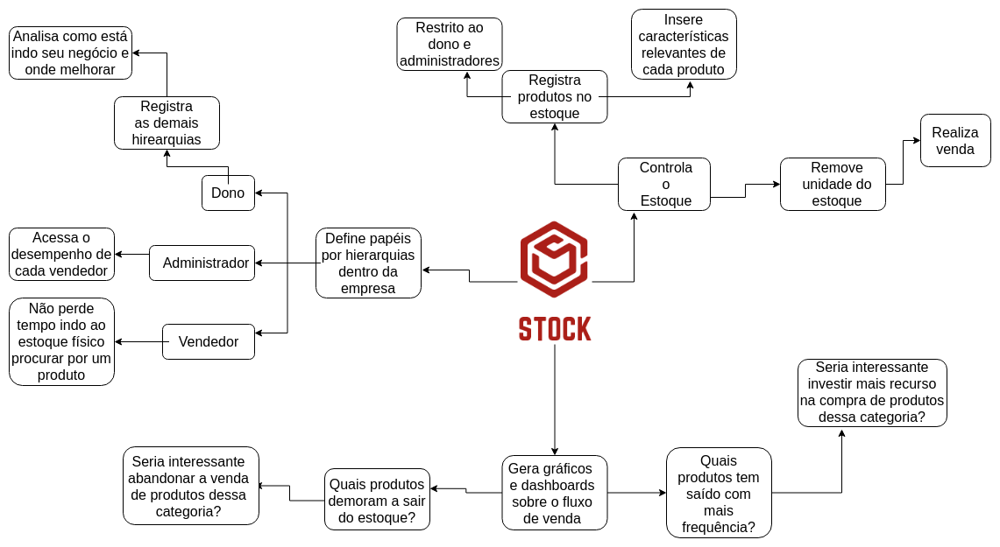
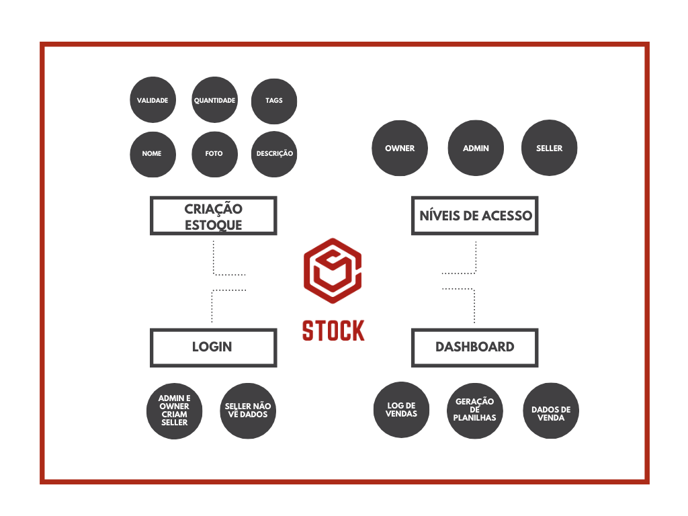

# Mapa Mental

Mapa mental é uma técnica utilizada no início do projeto e tem como objetivo colocar as ideias no papel, em forma de desenhos e setas, facilitando associações entre as informações mais relevantes. Essa técnica ajuda a memorizar os pontos mais importantes do produto, e ajuda a trazer novas ideias ao projeto. Diferentemente do Rich Picture, mapa mental possui um tom mais livre de associação, dando autonomia para o membro em desenhar da forma que quiser.

Para o projeto, cada membro do time fez seu mapa mental de tema livre.

## Histórico de Revisões

|    Data    | Versão |         Descrição         |           Autor(es)            |
| :--------: | :----: | :-----------------------: | :----------------------------: |
| 22/08/2020 |  1.0   |  Criação de mapa mental geral. | Gabriel Alves, Gabriel Davi, Micaella Gouveia, Pedro Igor e Sofia Patrocínio | 
| 24/08/2020 |  1.1   |  Criação de mapa mental individual. | Sofia Patrocínio | 
| 25/08/2020 |  1.2   |  Criação de mapa mental individual.| Pedro Igor | 
| 27/08/2020 |  1.3   |  Criação de mapa mental individual. | Gabriel Davi | 
| 31/08/2020 |  1.4   |  Criação de mapa mental individual.. | Micaella Gouveia |
| 31/08/2020 |  1.5   |  Criação de mapa mental individual. | Gabriel Alves | 
| 31/08/2020 |  1.6   |  Criação do documento e adição dos mapas mentais produzidos. | Micaella Gouveia |

## Mapas Mentais

### Gabriel Alves

### Gabriel Davi

### Micaella

### Pedro Igor

### Sofia

 

## Referências
- Mapa Mental - <https://www.stoodi.com.br/blog/dicas-de-estudo/como-fazer-um-mapa-mental/>. Último acesso em 31/08/2020.