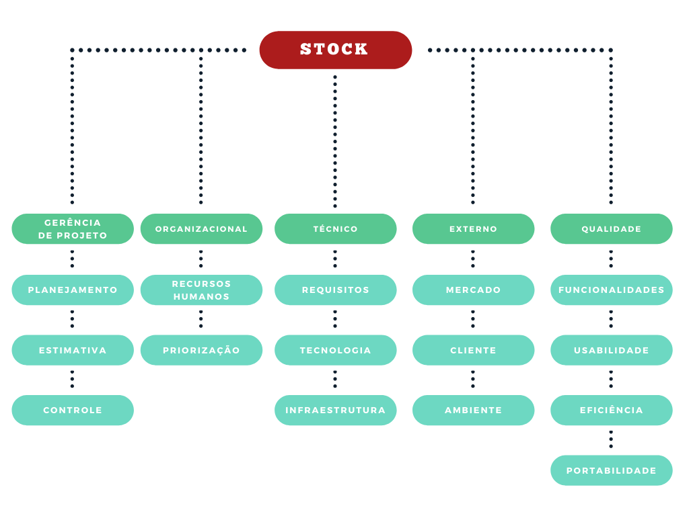

# CONTROLE DE RISCOS

## Histórico de Revisão
| Data | Versão | Descrição | Autor(es) |
| :--: | :----: | :-------: | :-------: |
| 03/09/2020| 1.0|Criação do documento e elicitação dos riscos, probabilidades, impactos e ações| Gabriel Alves, Gabriel Davi, Micaella Gouveia, Pedro Igor, Sofia Patrocínio
| 03/09/2020| 1.1| Adição da estrutura analítica de riscos| Sofia Patrocínio|
| 03/09/2020| 1.2 | Adição das tabelas por tópicos, criação da tabela de análise | Micaella Gouveia |

## Introdução

O objetivo deste documento é explicitar como aconteceu o plano de análise de riscos. O gerenciamento de riscos está incluso no processo de gerenciamento de projeto que inclui, além dos riscos, pessoas, custos, escopo, entre outros. O documento define como serão identificados, quantificados e qualificados, mantidos e controlados todos os riscos previstos.

## Estrutura Análitica de Riscos

### Descrição dos Itens da Estrutura analítica de Risco

#### Gerência de projeto
- **Planejamento**: São riscos relacionados a erros de planejamento, como tarefas grandes em períodos curtos.
- **Estimativa**: São erros que dizem respeito a erros de estimativa, como por exemplo erros de pontuação de histórias de usuário.
- **Controle**: São riscos referentes a falta de ação sobre riscos identificados.

#### Organizacional
- **Recursos Humanos**: Corresponde aos riscos relacionados aos recursos humanos, bem como o comprometimento da equipe de desenvolvimento e falta de comunicação entre as partes envolvidas.
- **Priorização**: São riscos relacionados aos erros de priorização, gerando atrasos nas entregas, por existir dependências entre as tarefas.

#### Técnico
- **Requisitos**: Riscos relacionados aos requisitos levantados e ao escopo definido.
- **Tecnologia**: É relativo a riscos relacionados às tecnologias e ferramentas utilizadas no projeto.
- **Infraestrutura**: Um dos pontos mais críticos do gerenciamento de riscos em projetos de software, pois geralmente nos esquecemos de providenciar com antecedência a infraestrutura onde o software será executado. Envolve toda a questão de arquitetura, definição de tecnologia.

#### Gerência de projeto
- **Planejamento**: São riscos relacionados a erros de planejamento, como tarefas grandes em períodos curtos.
- **Estimativa**: São erros que dizem respeito a erros de estimativa, como por exemplo erros de pontuação de histórias de usuário.
- **Controle**: São riscos referentes à falta de ação sobre riscos identificados.

#### Qualidade
- **Funcionalidade**: Contempla tudo relacionado à funcionalidade do software.
- **Usabilidade**: A usabilidade engloba todos os aspectos referentes à interface com o usuário, facilidade e acessibilidade.
- **Eficiência**: Garantir que o usuário consiga ter as respostas da aplicação de forma rápida e coesa.
- **Portabilidade**: Se refere a que plataformas/sistemas operacionais o software irá rodar e como será feita a compatibilidade.

## Probabilidade 
| Probabilidade | % de certeza | Peso |
| - | - | - |
| Nula | 0% | 0 |
| Muito baixa | 0 a 20%| 1 |
| Baixa | 20 a 40% | 2 |
| Média | 40 a 60% | 3 |
| Alta | 60 a 80% | 4 |
| Muito alta | 80 a 100% | 5 |   

## Impacto
| Impacto | Descrição | Peso |
| :-----: | :-------: | :--: |
| Muito Baixo |	Quase imperceptível para o projeto | 1 |
| Baixo	| Emite pouco impacto sobre o projeto |	2 |
| Médio | Existe um impacto considerável, mas é recuperável |	3 |
| Alto | Existe grande impacto no projeto | 4 |
| Muito Alto | Impede o prosseguimento do projeto | 5 |

### O grau de risco é definido pela multiplicação entre probabilidade e impacto. Conforme tabela abaixo:

Sendo que:

1. Risco >= 15: **Elevado**
2. 5 < Risco < 15: **Médio**
3. Risco =< 5: **Baixo** 

## Riscos organizacionais
|ID | Risco | Probabilidade | Impacto | Grau de Risco |
| - | -  -  |       -       |  -      |    -          |    
| 1 | Falha de comunicação        | 2 | 5 | **10**|
| 2 | Descomprometimento da Equipe| 1 | 4 | **4** |
| 3 | Erro de Priorização         | 3 | 4 | **12**| 
| 4 | Desistência de Membros      | 2 | 4 | **8** |
| 5 | Desavenças entre os membros | 1 | 2 | **2** | 
| 6 | Tensão de fim de semestre   | 4 | 3 | **12**| 
| 7 | Falta de motivação          | 2 | 3 | **6** | 
| 8 | Atraso nas entregas         | 3 | 3 | **9** |

## Riscos técnicos
|ID | Risco | Probabilidade | Impacto | Grau de Risco |
| - | -  -  |       -       |  -      |    -          |
| 9 | Dificuldade com as tecnologias     | 3 | 4 | **12** |
|10 | Dificuldade em criar backlog       | 2 | 4 |  **8** |
|11 | Má escolha das tecnologias         | 2 | 4 |  **8** |
|12 | Dificuldade de ambientação         | 3 | 3 |  **9** | 
|13 | Arquitetura mal definida           | 3 | 4 | **12** | 
|14 | Dificuldade de deploy da aplicação | 2 | 5 | **10** | 
|15 | Dificuldade em hospedar a aplicação| 3 | 4 | **12** |
|16 | Documentação que induz ao erro     | 2 | 4 | **8**  | 

## Riscos de Qualidade
|ID | Risco | Probabilidade | Impacto | Grau de Risco |
| - | -  -  |       -       |  -      |    -          |
|17 | Ausência de testes	                        | 3 | 3 | **9** | 
|18 | Falhas e bugs                                 | 4 | 4 | **16** | 
|19 | Má implementação de UX                        | 3 | 3 | **9** | 
|20 | Má implementação de UI                        | 2 | 3 | **6** | 
|21 | Má prática do processo de desenvolvimento     | 4 | 3 | **12** | 
|22 | Aplicação não atender expectativas do usuário | 3 | 4 | **12** | 
|23 | Não cumprimento dos requisitos elicitados     | 3 | 4 | **12** |  
|24 | Falta de validação com o stakeholder          | 3 | 4 | **12** |

## Riscos de Gerência de projeto
|ID | Risco | Probabilidade | Impacto | Grau de Risco |
| - | -  -  |       -       |  -      |    -          | 
|25 | Escopo mal definido                       | 2 | 4 | **8** | 
|26 | Mudança Arquitetural                      | 2 | 4 | **8** | 
|27 | Má gestão do tempo                        | 3 | 3 | **9** | 
|28 | Cronograma inviável                       | 2 | 3 | **6** | 
|29 | Má pontuação das US                       | 1 | 2 | **2** | 
|30 | Problema no autogerenciamento da equipe   | 2 | 3 | **6** | 
|31 | Sobrecarga de tarefas                     | 4 | 3 | **12** | 
|32 | Mudanças de tecnologias                   | 2 | 4 | **8** | 
|33 | Horários divergentes dos integrantes      | 3 | 3 | **9** |

## Riscos Externos
|ID | Risco | Probabilidade | Impacto | Grau de Risco |
| - | -  -  |       -       |  -      |    -          |
|34 | Suspensão das aulas                                                 | 3 | 5 | **15** | 
|35 | Baixa adesão da aplicação                                           | 3 | 4 | **12** | 
|36 | Imprevistos com infraestrutura(internet, energia, computador)       | 4 | 4 | **16** | 
|37 | Afastamento de integrante (enfermidade, luto, assistência familiar) | 4 | 4 | **16** |
|38 | Atualizações drásticas das tecnologias escolhidas                   | 1 | 2 | **2** |

 

# Planejamento de respostas aos riscos

<table>
    <thead>
        <tr>
            <th scope="col">Grau</td>
            <th scope="col">#</td>
            <th scope="col">Risco</td>
            <th scope="col">Ação</td>
            <th scope="col">Solução</td>
        </tr>
    </thead>
    <tbody>
        <tr class="risco baixo" style="background:#FFFF66">
            <th>2</th> 
            <td>5</td>
            <td>Desavenças entre os membros</td>
            <td>Prevenir</td>
            <td>Respeitar tempo, opinião e limitações dos membros, ser empático</td>
        </tr>
        <tr class="risco baixo" style="background:#FFFF66">
            <th>2</th>
            <td>29</td>
            <td>Má pontuação das US</td>
            <td>Prevenir</td>
            <td>Definir com todos os membros a pontuação</td>
        </tr>
        <tr class="risco baixo" style="background:#FFFF66">
            <th>2</th>
            <td>38</td>
            <td>Atualizações drásticas das tecnologias escolhidasS</td>
            <td>Aceitar</td>
            <td>Se necessário, adaptar-se à nova atualização</td>
        </tr>
        <tr class="risco baixo" style="background:#FFFF66">
            <th>4</th>
            <td>2</td>
            <td>Descomprometimento da Equipe</td>
            <td>Mitigar</td>
            <td>Incentivar dailys, comentários em PRs e no grupo do telegram.</td>
        </tr>
        <tr class="risco médio" style="background:#FFB366">
            <th>6</th>
            <td>7</td>
            <td>Falta de motivação</td>
            <td>Prevenir</td>
            <td> Incentivar dailys, comentários em PRs e no grupo do telegram, mostrar propósito e impacto  das suas ações e suas responsabilidades, dar feedbacks tanto construtivos quanto positivos</td>
        </tr>
        <tr class="risco médio" style="background:#FFB366">
            <th>6</th>
            <td>20</td>
            <td>Má implementação de UI</td>
            <td>Prevenir</td>
            <td>Estudar sobre UI e testar todas as fases com usuário</td>
        </tr>
        <tr class="risco médio" style="background:#FFB366">
            <th>6</th>
            <td>28</td>
            <td>Cronograma inviável</td>
            <td>Mitigar</td>
            <td>Fazer planejamento conforme as entregas definidas</td>
        </tr>
        <tr class="risco médio" style="background:#FFB366">
            <th>6</th>
            <td>30</td>
            <td>Problema no autogerenciamento da equipe</td>
            <td>Prevenir</td>
            <td>Ter bem definido dias e horários de reunião, pareamentos e entregas</td>
        </tr>
        <tr class="risco médio" style="background:#FFB366">
            <th>8</th>
            <td>4</td>
            <td>Desistência de Membros</td>
            <td>Aceitar </td>
            <td>Realocar tarefas para os membros restantes</td>
        </tr>
        <tr class="risco médio" style="background:#FFB366">
            <th>8</th>
            <td>10</td>
            <td>Dificuldade em criar backlog</td>           
            <td>Prevenir</td>
            <td>Valorizar fase de modelagem e definir backlog com todos os membros</td>
        </tr>
        <tr class="risco médio" style="background:#FFB366">
            <th>8</th>
            <td>11</td>
            <td>Má escolha das tecnologias</td>
            <td>Prevenir</td>
            <td>Estudar sobre as tecnologias de acordo com a arquitetura definida</td>
        </tr>
        <tr class="risco médio" style="background:#FFB366">
            <th>8</th>
            <td>16</td>
            <td>Documentação que induz ao erro</td>
            <td>Prevenir</td>
            <td>Valorizar a fase de documentação e mantê-las atualizadas, além de todos os membros estarem alinhados com os documentos produzidos </td>
        </tr>
        <tr class="risco médio" style="background:#FFB366">
            <th>8</th>
            <td>25</td>
            <td>Escopo mal definido</td>
            <td>Prevenir</td>
            <td> Ter as principais funcionalidades bem definidas e se basear nelas</td>
        </tr>
        <tr class="risco médio" style="background:#FFB366">
            <th>8</th>
            <td>26</td>
            <td>Mudança Arquitetural</td>
            <td>Prevenir</td>
            <td>Estudar sobre arquitetura, validar com a professora</td>
        </tr>
        <tr class="risco médio" style="background:#FFB366">
            <th>8</th>
            <td>32</td>
            <td>Mudanças de tecnologias</td>
            <td>Prevenir</td>
            <td>Estudar sobre as tecnologias utilizadas</td>
        </tr>
        <tr class="risco médio" style="background:#FFB366">
            <th>9</th>
            <td>8</td>
            <td>Atraso nas entregas</td>
            <td>Prevenir </td>
            <td>Dar prioridade às tarefas, saber dividir o cronograma das sprints</td>
        </tr>
        <tr class="risco médio" style="background:#FFB366">
            <th>9</th>
            <td>12</td>
            <td>Dificuldade de ambientação</td>
            <td>Mitigar</td>
            <td>Estudar sobre as tecnologias utilizadas</td>
        </tr>
        <tr class="risco médio" style="background:#FFB366">
            <th>9</th>
            <td>17</td>
            <td>Ausência de testes</td>
            <td>Mitigar</td>
            <td>Organizar e priorizar aquilo que mais precisa de testes</td>
        </tr>
        <tr class="risco médio" style="background:#FFB366">
            <th>9</th>
            <td>19</td>
            <td>Má implementação de UX</td>
            <td>Prevenir</td>
            <td>Testar todas as fases com usuário</td>
        </tr>
        <tr class="risco médio" style="background:#FFB366">
            <th>9</th>
            <td>27</td>
            <td>Má gestão do tempo</td>
            <td>Prevenir</td>
            <td>Definir entregas e atividades</td>
        </tr>
        <tr class="risco médio" style="background:#FFB366">
            <th>9</th>
            <td>33</td>
            <td>Horários divergentes dos integrantes</td>
            <td>Mitigar</td>
            <td>Ser flexível com em relação ao horário e às tarefas que serão realizadas</td>
        </tr>
        <tr class="risco médio" style="background:#FFB366">
            <th>10</th>
            <td>1</td>
            <td>Falha de comunicação </td>
            <td>Mitigar</td>
            <td>Incentivar dailys, comentários em PRs e no grupo do telegram.</td>
        </tr>
        <tr class="risco médio" style="background:#FFB366">
            <th>10</th>
            <td>14</td>
            <td>Dificuldade de deploy da aplicação</td>
            <td>Mitigar</td>
            <td>Estudar sobre as tecnologias utilizadas</td>
        </tr>
        <tr class="risco médio" style="background:#FFB366">
            <th>12</th>
            <td>3</td>
            <td>Erro de Priorização</td>
            <td>Prevenir </td>
            <td>Definir a prioridade e seguir a documentação</td>
        </tr>
        <tr class="risco médio" style="background:#FFB366">
            <th>12</th>
            <td>6</td>
            <td>Tensão de fim de semestre</td>
            <td>Mitigar</td>
            <td> Não acumular tarefas para o fim de semestre, manter clima empático</td>
        </tr>
        <tr class="risco médio" style="background:#FFB366">
            <th>12</th>
            <td>9</td>
            <td>Dificuldade com as tecnologias</td>
            <td>Mitigar </td>
            <td>Estudar previamente e fazer pareamentos conforme o  quadro de conhecimento</td>
        </tr>
        <tr class="risco médio" style="background:#FFB366">
            <th>12</th>
            <td>13</td>
            <td>Arquitetura mal definida</td>
            <td>Prevenir</td>
            <td>Estudar sobre arquitetura, validar com a professora</td>
        </tr>
        <tr class="risco médio" style="background:#FFB366">
            <th>12</th>
            <td>15</td>
            <td>Dificuldade em hospedar a aplicação</td>
            <td>Mitigar</td>
            <td>Estudar sobre as tecnologias utilizadas</td>
        </tr>
        <tr class="risco médio" style="background:#FFB366">
            <th>12</th>
            <td>21</td>
            <td>Má prática do processo de desenvolvimento</td>
            <td>Prevenir</td>
            <td>Estudar boas práticas de programação</td>
        </tr>
        <tr class="risco médio" style="background:#FFB366">
            <th>12</th>
            <td>22</td>
            <td>Aplicação não atender expectativas do usuário</td>
            <td>Prevenir</td>
            <td>Testar todas as fases com usuário, recebendo feedbacks e respondendo-os</td>
        </tr>
        <tr class="risco médio" style="background:#FFB366">
            <th>12</th>
            <td>23</td>
            <td>Não cumprimento dos requisitos elicitados</td>
            <td>Prevenir</td>
            <td>Estar alinhado com a documentação</td>
        </tr>
        <tr class="risco médio" style="background:#FFB366">
            <th>12</th>
            <td>24</td>
            <td>Falta de validação com o stakeholder</td>
            <td>Prevenir</td>
            <td>Manter contato com o stakeholder</td>
        </tr>
        <tr class="risco médio" style="background:#FFB366">
            <th>12</th>
            <td>31</td>
            <td>Sobrecarga de tarefas</td>
            <td>Prevenir</td>
            <td>Alertar sobre semanas mais corridas, dias de prova, entre outros</td>
        </tr>
        <tr class="risco médio" style="background:#FFB366">
            <th>12</th>
            <td>35</td>
            <td>Baixa adesão da aplicação</td>
            <td>Mitigar</td>
            <td>Fazer publicidade do aplicativo para o nosso público alvo</td>
        </tr>
        <tr class="risco médio" style="background:#FF6666">
            <th>15</th>
            <td>34</td>
            <td>Suspensão das aulas</td>
            <td>Aceitar</td>
            <td>Aguardar o retorno das aulas</td>
        </tr>
        <tr class="risco médio" style="background:#FF6666">
            <th>16</th>
            <td>37</td>
            <td>Afastamento de integrante (enfermidade, luto, assistência familiar)</td>
            <td>Aceitar</td>
            <td>Tentar realocar as tarefas de acordo com o que aconteceu</td>
        </tr>
        <tr class="risco médio" style="background:#FF6666">
            <th>16</th>
            <td>36</td>
            <td>Imprevistos com infraestrutura(internet, energia, computador)</td>
            <td>Aceitar</td>
            <td>Tentar realocar as tarefas de acordo com o que aconteceu</td>
        </tr>
        <tr class="risco médio" style="background:#FF6666">
            <th>16</th>
            <td>18</td>
            <td>Falhas e bugs</td>
            <td>Mitigar</td>
            <td>Dedicar issues de bugs e refatoração</td>
        </tr>
    </tbody>
</table>

## Análise

* Com a definição de todos os riscos, percebemos que esse semestre é muito atípico, e questões que não temos controle podem acontecer, gerando a interrupçãoo do projeto. 
* Riscos gerenciais e de infraestrutura são muito relevantes, devido à falta de experiência do time.
* Riscos de entrosamento e motivação da equipe aparenta ser o menor dos problemas, pois todos se vêem motivados e capacitados de fazer a matéria da melhor forma possível.

## Referências
* Wiki Gaia <https://fga-eps-mds.github.io/2019.1-Gaia/#/projeto/planoRisco> último acesso em 03/09/2020.
* Wiki A Monitoria <https://2019-2-arquitetura-desenho.github.io/wiki/dinamica_seminario_II/controle_riscos> último acesso em 03/09/2020.
* Vídeo <https://youtu.be/HDMS7ftQJb0> último acesso em 01/09/2020. (Disponibilizado pela professora Milene).
