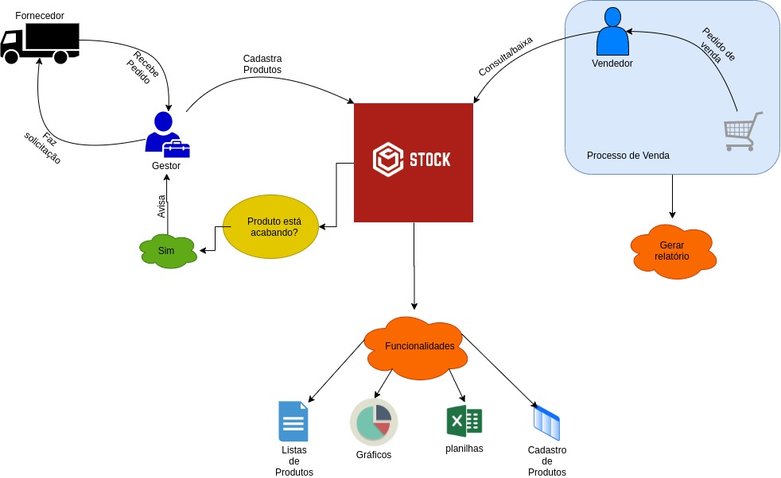
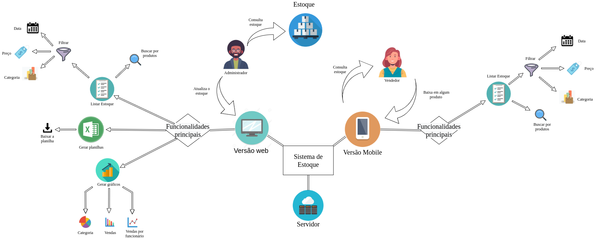
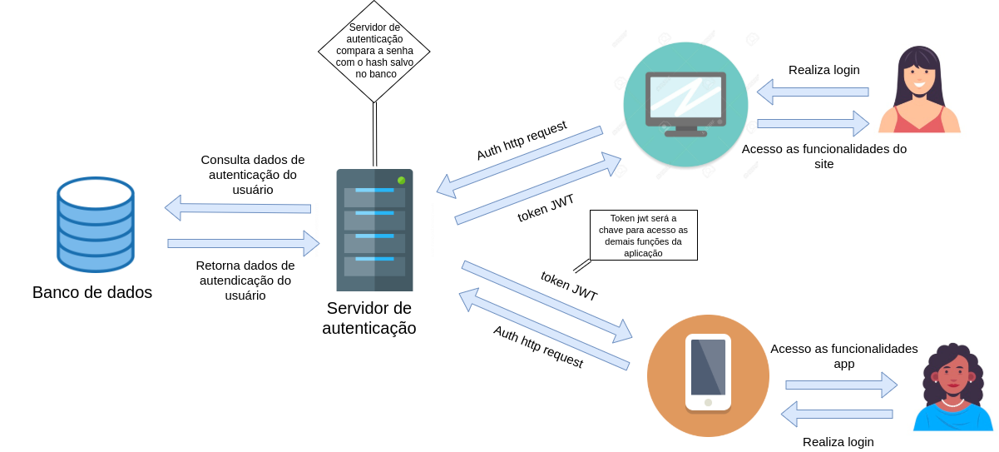
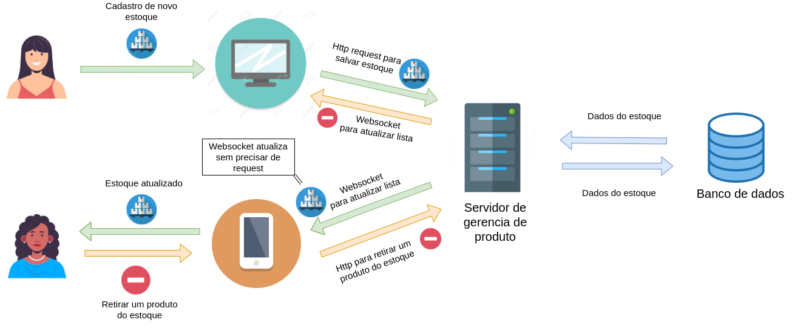
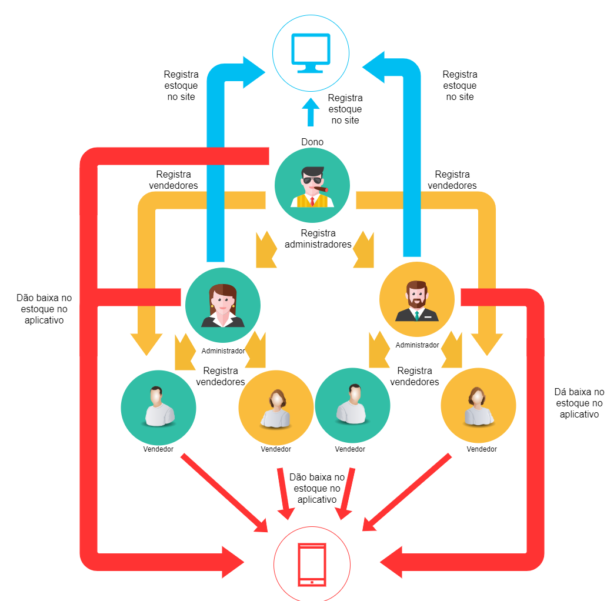

# Rich Picture

Rich picture é uma técnica que tem como objetivo entender o funcionamento e o processo de uma situação complexa. A ideia dele é abstrair, em forma de desenhos e ligações, elementos do processo que são essenciais para seu complexidade. Além disso, é possível abstrair de forma mais geral até chegar em um nível de especificidade maior, tratando de questões mais técnicas.

## Históricos de Revisões
|    Data    | Versão |         Descrição         |           Autor(es)            |
| :--------: | :----: | :-----------------------: | :----------------------------: |
| 21/08/2020 |  1.0   |  Criação dos Rich Pictures gerais. | Gabriel Davi | 
| 22/08/2020 |  1.1   |  Criação de Rich Picture individual. | Pedro Igor | 
| 24/08/2020 |  1.2   |  Criação do Rich Picture individual. | Micaella Gouveia |
| 24/08/2020 |  1.3   |  Criação do Rich Picture individual. | Gabriel Alves |
| 28/08/2020 |  1.4   |  Criação dos Rich Picture individual. | Sofia Patrocínio | 
| 28/08/2020 |  1.5   |  Criação do documento e adição dos Rich Pictures. | Micaella Gouveia | 
| 29/08/2020 |  1.6   |  Adição dos nomes dos Rich Pictures. | Micaella Gouveia, Gabriel Davi, Sofia Patrocínio | 
## Realização

Para o projeto, decidimos que cada membro faria inicialmente o seu Rich Picture, com nível de abstração livre, afim de ser discutido na reunião semanal da Sprint 1.

## Rich Pictures

### Gabriel Alves
* Rich Picture Geral

### Gabriel Davi

* Rich Picture Geral

* Autenticação

* Cadastro de Estoque

### Micaella Gouveia

* Hierarquia de Usuários

### Pedro Igor

* Hierarquia de Usuários

### Sofia Patrocínio

* Rich Picture Geral

## Referências

- Rich Pictures: <http://systems.open.ac.uk/materials/T552/pages/rich/richAppendix.html>. Último acesso em 28/08/2020.
