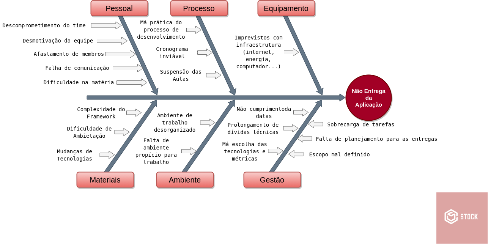
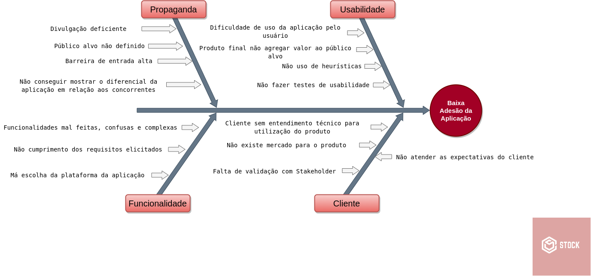
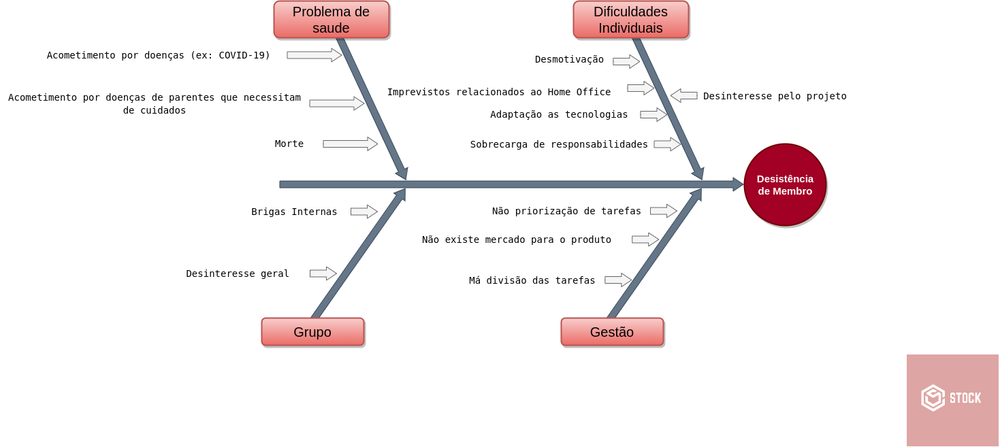
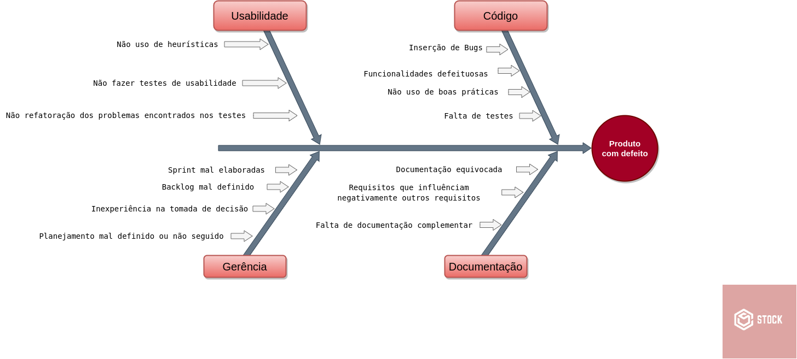
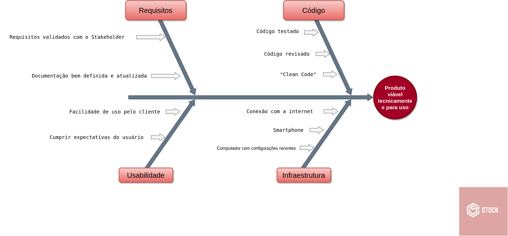
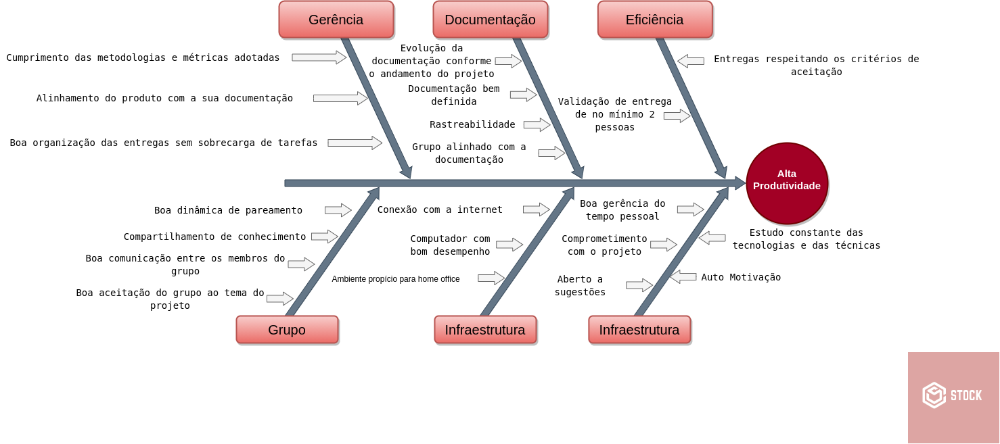

# Causa e Efeito
**Este artefato foi produzido durante o dia 4 da Design Sprint, para saber mais sobre a metodologia e como ela foi feita, clique aqui: *[Design Sprint](DesignSprint/DesignSprint.md)***

## Histórico de Revisão

|    Data    | Versão |         Descrição         |           Autor(es)            |
| :--------: | :----: | :-----------------------: | :----------------------------: |
| 04/09/20   |  1.0   | Criação do documento e levantamento de seus efeitos e suas respectivas causas | Gabriel Alves, Gabriel Davi, Micaella Gouveia, Pedro Igor, Sofia Patrocínio |
| 06/09/20   |  1.1   | Elaboração das tabelas e diagramas dos seus efeitos e suas respectivas causas | Gabriel Alves |
| 09/09/2020 |  1.2   | Correção da rota de hyperlink para página de Design Sprint | Sofia Patrocínio |

## Introdução

O diagrama Causa e Efeito, conhecido também como diagrama Ishikawa ou Espinha de peixe, é uma forma de levantar os fatores/causas que levam a um determinado efeito, seja ele positivo ou negativo, a fim de se obter as informações necessárias para auxiliar na tomada de decisão de possíveis erros ou melhorias no projeto.

## Efeitos Negativos

### Não Entrega da aplicação

|  Pessoal  |  Processo  |  Equipamento  |  Materiais  |  Ambiente  |  Gestão  |
|  :-----:  |  :------:  |  :---------:  |  :-------:  |  :------:  |  :----:  |
|Descomprometimento do time|Má prática do processo de desenvolvimento|Imprevistos com infraestrutura (internet, energia, computador)|Complexidade do Framework|Ambiente de trabalho desorganizado|Não cumprimento das datas|
|Desmotivação da equipe|Cronograma inviável|-|Difulcadade de ambientação|Falta de ambiente propício para trabalho|Prolongamento de dívidas técnicas|
|Afastamento de membros|Suspensão das aulas|-|Mudança de tecnologias|-|Má escolha das metodologias e métricas|
|Falha de Comunicação|-|-|-|-|Sobrecarga de tarefas|
|Dificuldade na Matéria|-|-|-|-|Falta de planejamento para as entregas|
|-|-|-|-|-|Escopo mal definido|

 

### Baixa Adesão da Aplicação

|  Propaganda  |  Usabilidade  |  Funcionalidade  |  Cliente  |
|  :--------:  |  :---------:  |  :------------:  |  :-----:  |
|Divulgação deficiente|Dificuldade de uso da aplicação pelo usuário|Funcionalidades mal feitas, confusas e complexas|Cliente sem entendimentos técnico para utilização do produto|
|Público alvo não definido|Produto final não agregar valor ao público alvo|Não cumprimento dos requisitos elicitados|Não existe mercado para o produto|
|Barreira de entrada alta|Não uso de heurísticas|Má escolha da plataforma da aplicação|Falta de validação com Stakeholder|
|Não conseguir mostrar o diferencial da aplicação em relação aos concorrentes|Não fazer testes de usabilidade|  -  |Não atender expectativa do cliente|

 

### Desistência de Membro

|  Problema de Saúde  |  Dificuldades Individuais  |  Grupo  |  Gestão  |
|  :---------------:  |  :----------------------:  |  :---:  |  :----:  |
|Acomentimento por doenças (ex: COVID-19) |Desmotivação|Brigas internas|Não priorização de tarefas|
|Morte |Imprevistos relacionados ao home office|Desinteresse geral do grupo|Má divisão das tarefas|
|Acomentimento por doenças de parentes que necessitam cuidados |Adaptação as tecnologias|-|-|
|- |Sobrecarga de responsabilidades (ex: trabalho e faculdade)|-|-|
|- |Desinteresse pelo projeto|-|-|

 

### Produto com Defeito

|  Usabilidade  |  Código  |  Gerência  |  Documentação  |
|  :---------:  |  :-----  |  :------:  |  :----------:  |
|Não uso de heurísticas| Inserção de bugs | Sprint mal elaboradas | Documentação equivocada |
|Não fazer testes de usabilidade| Funcionalidades defeituosas | Backlog mal definido | Requisitos que influênciam negativamente outros requisitos |
|Não refatoração dos problemas encontrados nos testes| Não uso de boas práticas | Inexperiência na tomada de decisão | Falta de documentação complementar |
| - | Falta de testes | Planejamento mal definido ou não seguido | - |

 

## Efeitos Positivos

### Produto Viável Tecnicamente e para uso

|  Requisitos  |  Código  |  Usabilidade  |  Infraestrutura  |
|  :---------:  |  :-----  |  :------:  |  :----------:  |
| Requisitos validados com os Stakeholders | Código testado | Facilidade de uso pelo cliente | Conexão com a Internet |
| Documentação bem definida e atualizada | Código Revisado | Cumprir expectativas do usuário | Smartphone |
| - | "Clean Code" | - | Computador com configurações recentes |

 

### Alta produtividade

|  Gerência  |  Documentação  |  Eficência  |  Grupo  |  Infraestrutura  |  Pessoal  |
|  :---------:  |  :-----  |  :------:  |  :----------:  |  :----------:  |  :----------:  |
| Cumprimento das metodologias e métricas adotadas | Evolução da documentação conforme o andamento do projeto | Entregas respeitando os critérios de aceitação |Boa dinâmica de pareamento|Conexão com a Internet|Boa gerência do tempo pessoal|
| Alinhamento do produto com a sua documentação | Documentação bem definida | Validação de entrega de no mínimo 2 (duas) pessoas | Compartilhamento de conhecimento |Computador com bom desempenho|Comprometimento com o projeto|
| Boa organização das entregas sem sobrecarga de tarefas | Rastreabilidade | - | Boa comunicação entre os membros do grupo |Ambiente propício para home office|Estudo constante das tecnologias e das técnicas|
| - | Grupo alinhado com a documentação | - | Boa aceitação do grupo ao tema do projeto | - |Aberto a sugestões|
| - | - | - | - | - | Auto motivação |

 

## Referências

- MARTINS, Rosemary. Diagrama de Ishikawa. Disponível em: https://blogdaqualidade.com.br/diagrama-de-ishikawa/. Último acesso em 06/09/2020.

- ANDRADE, Luiza. DIAGRAMA DE ISHIKAWA: O QUE É E COMO FAZER. Disponível em: https://www.siteware.com.br/metodologias/diagrama-de-ishikawa/. último acesso em 06/09/2020.